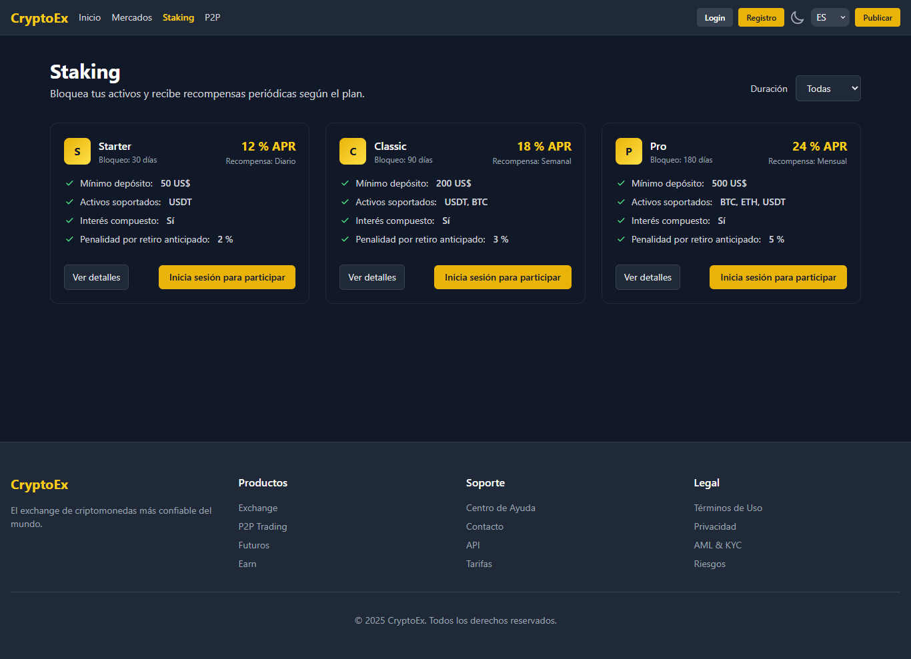
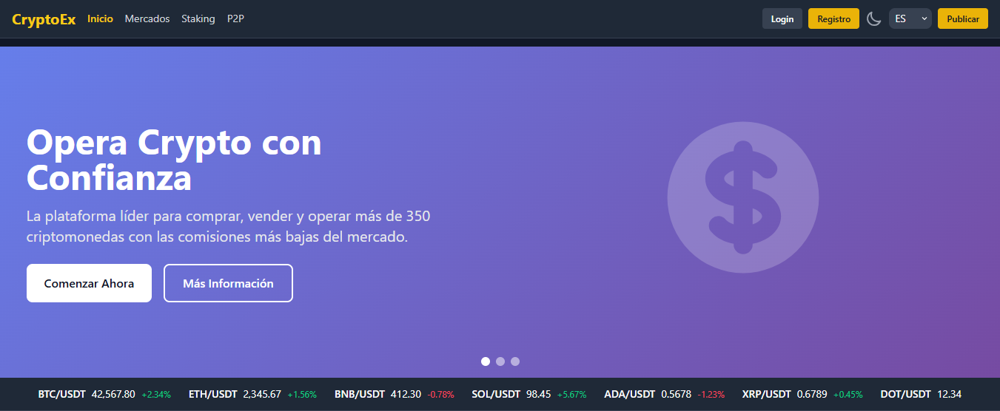

# Nuxt 3 Crypto Exchanger Template

Este es un template completo y moderno para un Exchange de Criptomonedas desarrollado con **Nuxt 3** y **Tailwind CSS**. Incluye funcionalidades avanzadas como Trading P2P, Mercado Spot, Staking y gestión de Billetera.

## 🚀 Características Principales

- **Trading P2P**: Plataforma peer-to-peer para compra y venta segura de activos.
- **Mercado Spot**: Interfaz de trading profesional con gráficos en tiempo real y libro de órdenes.
- **Staking Avanzado**: Soporte para Staking V1 y V2 con pools de liquidez.
- **Billetera Digital**: Gestión completa de activos, depósitos y retiros.
- **Diseño Responsivo**: Experiencia optimizada para dispositivos móviles y escritorio (detección automática).
- **Multi-idioma**: Soporte internacionalización (i18n) listo para Español e Inglés.
- **Seguridad**: Sistema de autenticación robusto y gestión de sesiones.
- **Tiempo Real**: Actualizaciones instantáneas utilizando Pusher.

## 📸 Capturas de Pantalla

### Mercado Spot (Trading)


### Vista de Mercados


### Plataforma de Staking


### Vista General


## 🛠️ Tecnologías Utilizadas

- **Framework Core**: [Nuxt 3](https://nuxt.com/)
- **UI Framework**: [Tailwind CSS](https://tailwindcss.com/)
- **State Management**: [Pinia](https://pinia.vuejs.org/)
- **Gráficos**: [Chart.js](https://www.chartjs.org/)
- **Real-time**: [Pusher](https://pusher.com/)
- **HTTP Client**: [Axios](https://axios-http.com/)
- **Iconos**: Remix Icon / Heroicons (según implementación)

## 📦 Instalación

Asegúrate de tener instalado [Node.js](https://nodejs.org/) (versión 16+ recomendada).

1. **Clonar el repositorio**
   ```bash
   git clone <tu-repositorio>
   cd exchanger_nuxt3
   ```

2. **Instalar dependencias**
   ```bash
   # Usando npm
   npm install

   # O usando yarn
   yarn install
   ```

3. **Configuración de Entorno**
   Crea un archivo `.env` en la raíz del proyecto basado en tus necesidades (API keys, endpoints, credenciales de Pusher, etc.).

## ▶️ Uso

### Servidor de Desarrollo
Inicia el servidor local en `http://localhost:3000`:

```bash
npm run dev
```

### Producción
Para construir la aplicación para producción:

```bash
npm run build
```

Para previsualizar la build de producción:

```bash
npm run preview
```

## 📂 Estructura del Proyecto

- `/components`: Componentes Vue reutilizables (P2P, Trading, UI).
- `/pages`: Rutas de la aplicación (Nuxt file-based routing).
- `/layouts`: Plantillas de diseño (Default, Auth, P2P).
- `/stores`: Gestión de estado con Pinia.
- `/composables`: Lógica reutilizable (Hooks).
- `/locales`: Archivos de traducción (en.json, es.json).
- `/assets`: Estilos globales y recursos estáticos.
- `/server`: API routes y middleware de servidor (si aplica).

---
Desarrollado con ❤️ usando Nuxt 3.
